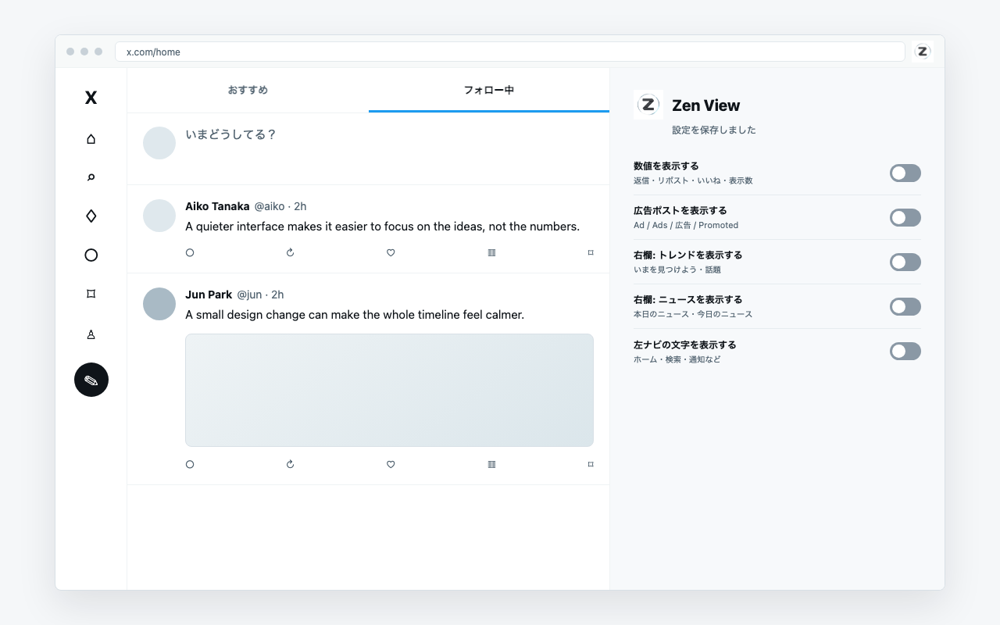
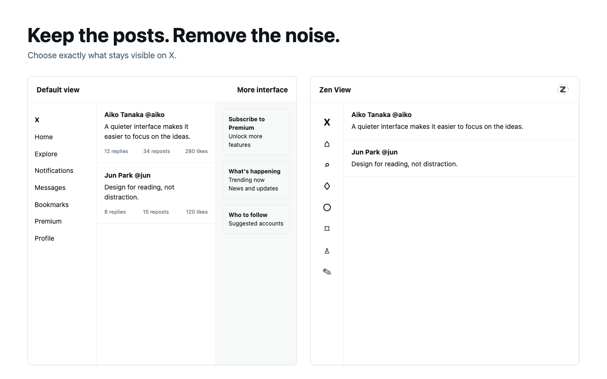

# Zen View for X

Zen View for X is a lightweight Chromium extension that makes X calmer and easier to read. It removes selected interface noise while keeping the timeline and normal post interactions usable.

The extension is developed and tested primarily in Arc and also supports Chromium-based browsers that implement Manifest V3.



## Features

- Hide reply, repost, like, and view counts.
- Hide promoted posts marked as ads.
- Show or hide Premium, live, recommendations, trends, and news modules independently.
- Remove the remaining right-rail search, dividers, placeholders, and legal links when every right-rail module is hidden.
- Turn the left navigation into a compact icon-only layout.
- Replace the large Post button with a compact pencil button.
- Open the same settings from the extension popup or the small in-page control.
- Save preferences locally in the browser.

Each switch uses a direct model: **on means visible** and **off means hidden**.

## Install Locally

1. Download or clone this repository.
2. In Arc or Chrome, open `chrome://extensions`.
3. Enable **Developer mode**.
4. Click **Load unpacked**.
5. Select the repository folder.
6. Open or reload `https://x.com`.

## Controls

The interface is currently available in Japanese:

- **数値を表示する**: reply, repost, like, and view counts.
- **広告ポストを表示する**: promoted posts.
- **右欄: プレミアムを表示する**: Premium subscription prompts.
- **右欄: ライブを表示する**: live broadcast prompts.
- **右欄: おすすめユーザーを表示する**: who-to-follow modules.
- **右欄: トレンドを表示する**: trends and what-is-happening modules.
- **右欄: ニュースを表示する**: news modules.
- **左ナビの文字を表示する**: labels in the left navigation.

## Development

Requires Node.js 20 or later.

```bash
npm install
npm test
npm run check
npm run package
```

The release ZIP is written to `dist/` with `manifest.json` at the archive root.

## Screenshots



All repository and store screenshots use synthetic demo content and contain no real account or timeline data.

## Privacy

Zen View for X does not collect or transmit personal data, page content, or browsing activity. It processes the X page locally and stores only extension preferences in `chrome.storage.local`. See [PRIVACY.md](PRIVACY.md).

## Limitations

X changes its interface frequently. Zen View combines stable `data-testid` selectors with a small `MutationObserver`, but future X changes may require selector updates.

Zen View for X is an independent project and is not affiliated with, endorsed by, or sponsored by X Corp.

## License

[MIT](LICENSE)
